# Front-End Design Essencial - HTML, CSS e JS Completo do Zero

https://www.udemy.com/course/front-end-essencial/

## <a name="indice">Índice</a>

1. [Seção 1: Introdução](#parte1)
2. [Seção 2: Introdução ao HTML e CSS](#parte2)
3. [Seção 3: Layouts, Grids e Flexbox](#parte3)
4. [Seção 4: Animações com CSS e SVG](#parte4)
5. [Seção 5: Javascript](#parte5)
6. [Seção 6: JQuery (opcional)](#parte6)
7. [Seção 7: Projeto Final](#parte7)
8. [Seção 8: Publicando o Site](#parte8)

---

## <a name="parte1">1 - Seção 1: Introdução</a>

1. Como tirar melhor proveito deste curso

[Voltar ao Índice](#indice)

---

## <a name="parte2">2 - Seção 2: Introdução ao HTML e CSS</a>

- 02 Estágios de um projeto


- 03 O que é HTML


- 04 Como fazer HTML


```html
<!DOCTYPE html>
<html>
<head>
    <title>Codesign Curso</title>
</head>
<body>
    <h1>Texto h1</h1>
    <h1>Texto h2</h1>
    <p>Paragrafo <span style="font-size: 20px">José</span></p>
</body>
</html>

```

- 05 Instalando e Configurando o Editor de Código
- 07 Tags e Semântica HTML


- 08 O que é CSS
- 09 Começando no CSS
- 10 Folha de estilos externa e cascata
- 11 Tipografia na web


- 12 Cores na Web


- 13 Exercício CSS 01 - Parte 1

[](Secao02-IntroducaoaoHTMLeCSS/13-Exercicio-CSS-01)

- 14 Exercício CSS 01 - Parte 2
- 15 Exercício CSS 01 - Parte 3
- 16 Exercício CSS 01 - Parte 4
- 17 Exercício CSS 01 - Parte 5
- 18 Design patterns e o Atomic Design

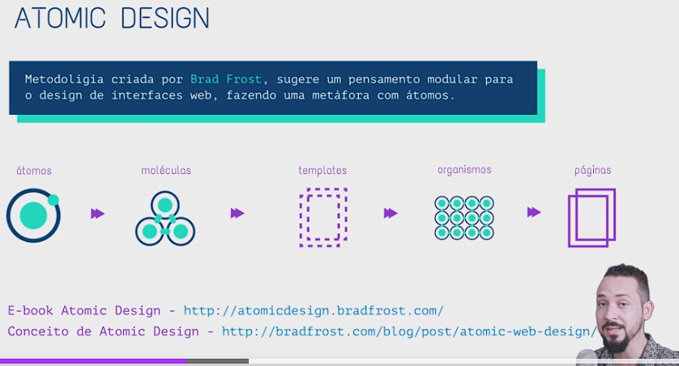

- 19 Exercício CSS 02 - Parte 1
- 20 Exercício CSS 02 - Parte 2
- 21 Exercício CSS 02 - Parte 3
- 22 Exercício CSS 02 - Parte 4
- 23 Exercício CSS 02 - Parte 5
- 24 Exercício CSS 02 - Parte 6
- 25 Exercício CSS 02 - Parte 7
- 26 Exercício CSS 02 - Parte 8

[Voltar ao Índice](#indice)

---

## <a name="parte3">3 - Seção 3: Layouts, Grids e Flexbox</a>

- 27 Tipos de layout web

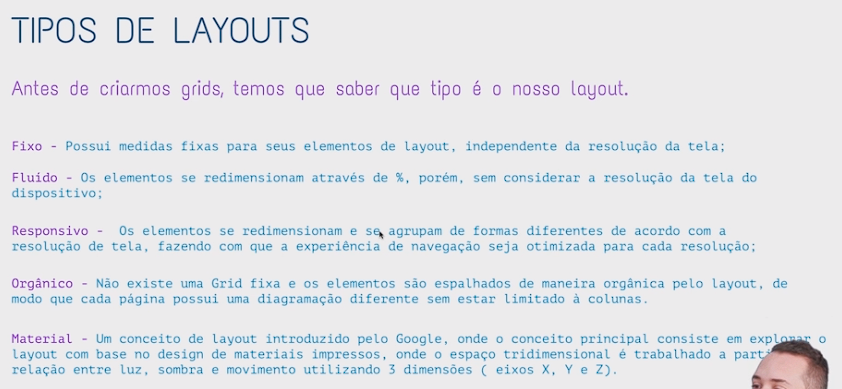

- 28 O que é design responsivo

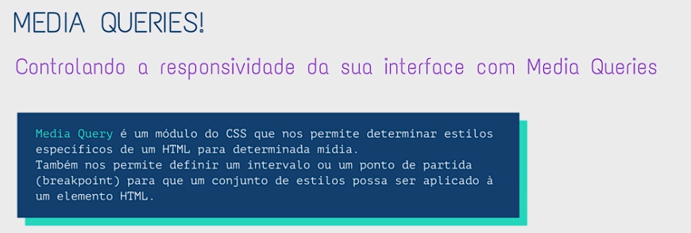

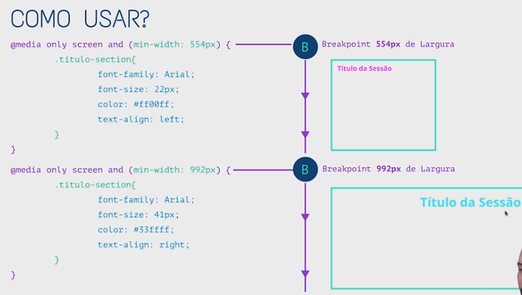

- 29 Fazendo design responsivo com Media Queries

- [Secao03-Layouts-Grids-e-Flexbox/29-Media-Queries](Secao03-Layouts-Grids-e-Flexbox/29-Media-Queries)

- 30 Sistemas de grid
- 31 Customizando e Baixando o Bootstrap Grid System

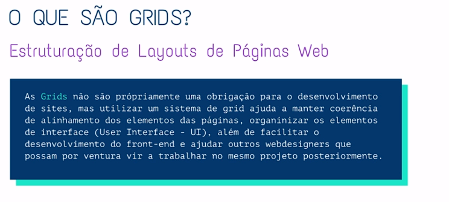

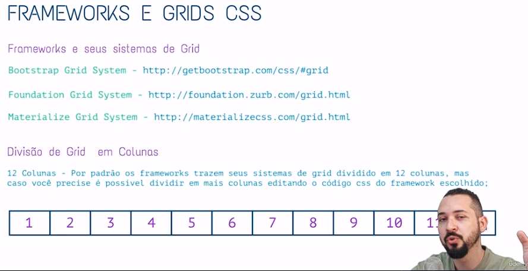

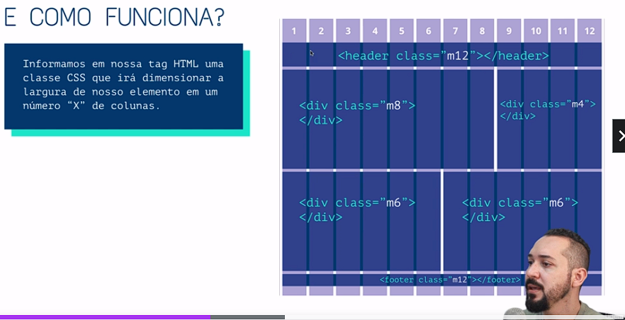

- 32 Usando o Bootstrap Grid System
- 33 Flexbox - Intro
- 34 Flexbox - Display Flex e Flex-Direction
- 35 Flexbox - Flex-Wrap
- 36 Flexbox - Justify-Content
- 37 Flexbox - Align-Items
- 38 Flexbox - Align-Content
- 39 Flexbox - Order
- 40 Flexbox - Flex-Grow
- 41 Flexbox - Flex-Shrink
- 42 Flexbox - Flex 'Shorthand'
- 43 Flexbox - Align-Self

[Voltar ao Índice](#indice)

---

## <a name="parte4">4 - Seção 4: Animações com CSS e SVG</a>


- 44 Animações com CSS - Intro

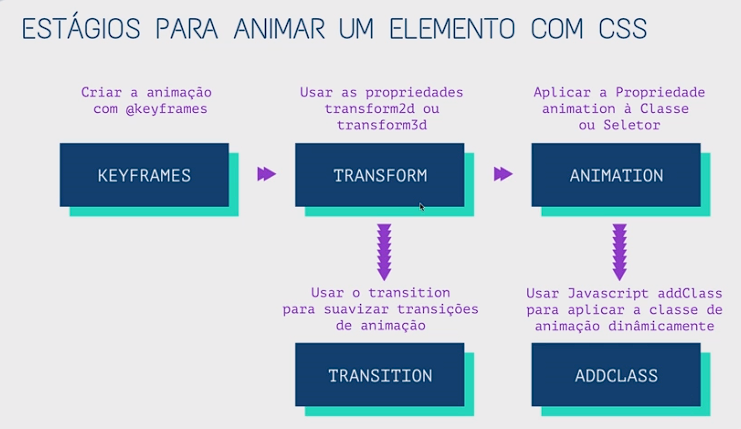

- 45 Animações com CSS - Parte 1
- 46 Animações com CSS - Parte 2
- 47 Animações com CSS - Transform
- 48 Animações com CSS - Exemplo de aplicação - Parte 1
- 49 Animações com CSS - Exemplo de aplicação - Parte 2
- 50 Site e Arquivos para a próxima aula

- https://animate.style/
- https://github.com/animate-css/animate.css/releases/tag/3.7.0

- 51 A biblioteca Animate.css

- [Secao04-AnimacoescomCSSeSVG/51-AbibliotecaAnimate](Secao04-AnimacoescomCSSeSVG/51-AbibliotecaAnimate)

- 52 Introdução ao SVG

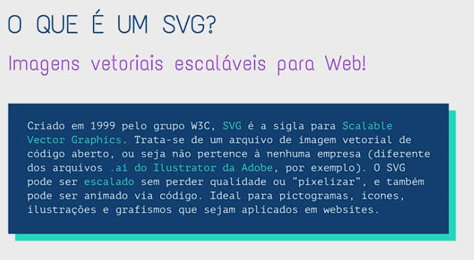

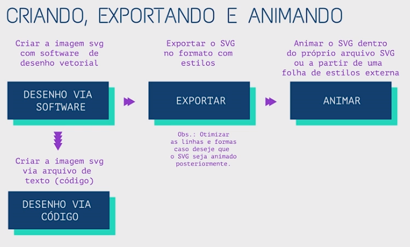

- 53 Criando SVGs - Parte 1
- 54 Criando SVGs - Parte 2


- 55 Inserindo SVGs no HTML - Parte 1
- 56 Inserindo SVGs no HTML - Parte 2

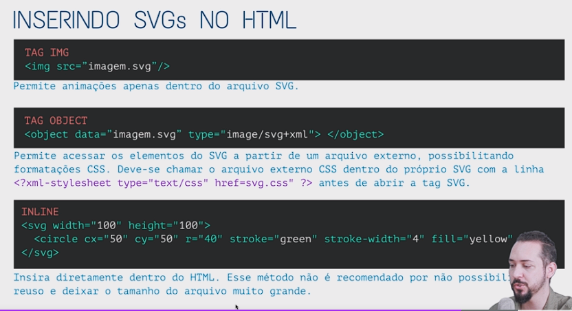

- 57 Animando Imagens SVG - Parte 1
- 58 Animando Imagens SVG - Parte 2

[Voltar ao Índice](#indice)

---

## <a name="parte5">5 - Seção 5: Javascript</a>

- 59 O que é Javascript
- 60 Client Side e Processo de Renderização
- 61 Conhecendo o Console
- 62 Sintaxe e API Javascript
- 63 O Objeto Window
- 64 Dados primitivos Javascript
- 65 Variáveis Javascript
- 66 Operadores e precedência
- 67 Seletores - Parte 1
- 68 Seletores - Parte 2
- 69 Condicionais - IF Else - Parte 1
- 70 Condicionais - IF Else - Parte 2
- 71 Condicionais - Switch Case
- 72 Eventos
- 73 Funções
- 74 Array - Parte 1
- 75 Array - Parte 2
- 76 Objetos - Parte 1
- 77 Objetos - Parte 2
- 78 Objetos - Parte 3
- 79 Loops
- 80 Loop For - Destrinchando a Sintaxe


[Voltar ao Índice](#indice)

---

## <a name="parte6">6 - Seção 6: JQuery (opcional)</a>

- 81 JQuery - Ressalva
- 82 JQuery - Versões
- 83 JQuery - Seletores e CSS
- 84 JQuery - Exercício Busca Gato - Parte 1
- 85 JQuery - Exercício Busca Gato - Parte 2
- 86 JQuery - Add, Remove e Toggle Class


[Voltar ao Índice](#indice)

---

## <a name="parte7">7 - Seção 7: Projeto Final</a>

[Voltar ao Índice](#indice)

---

## <a name="parte8">8 - Seção 8: Publicando o Site</a>

[Voltar ao Índice](#indice)

---
