# Front-End Design Essencial - HTML, CSS e JS Completo do Zero

https://www.udemy.com/course/front-end-essencial/

## <a name="indice">Índice</a>

1. [Seção 1: Introdução](#parte1)
2. [Seção 2: Introdução ao HTML e CSS](#parte2)
3. [Seção 3: Layouts, Grids e Flexbox](#parte3)
4. [Seção 4: Animações com CSS e SVG](#parte4)
5. [Seção 5: Javascript](#parte5)
6. [Seção 6: JQuery (opcional)](#parte6)
7. [Seção 7: Projeto Final](#parte7)
8. [Seção 8: Publicando o Site](#parte8)

---

## <a name="parte1">1 - Seção 1: Introdução</a>

1. Como tirar melhor proveito deste curso

[Voltar ao Índice](#indice)

---

## <a name="parte2">2 - Seção 2: Introdução ao HTML e CSS</a>

- 02 Estágios de um projeto

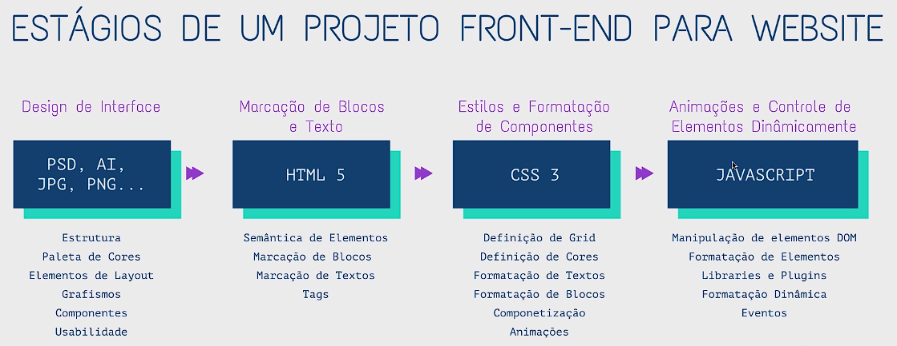

- 03 O que é HTML

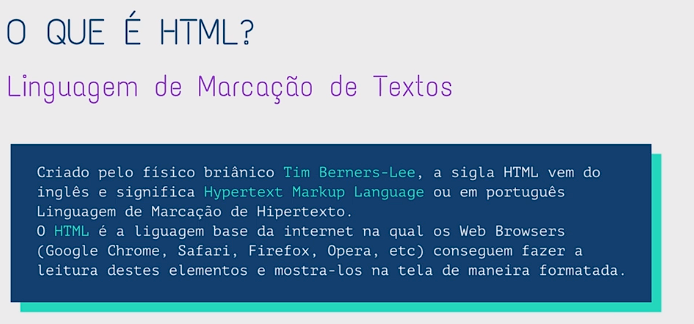

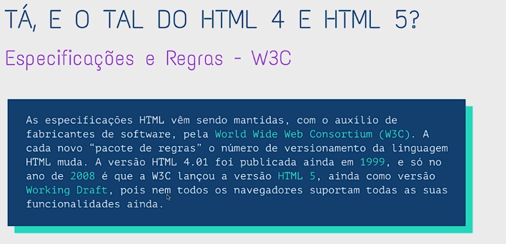

- 04 Como fazer HTML

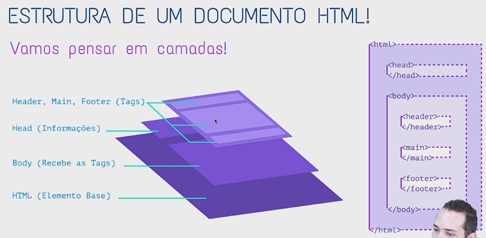

```html
<!DOCTYPE html>
<html>
<head>
    <title>Codesign Curso</title>
</head>
<body>
    <h1>Texto h1</h1>
    <h1>Texto h2</h1>
    <p>Paragrafo <span style="font-size: 20px">José</span></p>
</body>
</html>

```

- 05 Instalando e Configurando o Editor de Código
- 07 Tags e Semântica HTML

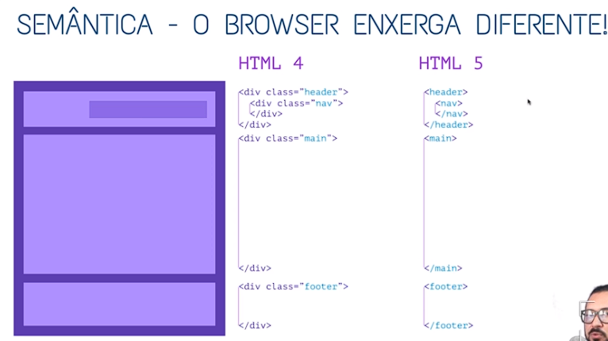

- 08 O que é CSS
- 09 Começando no CSS
- 10 Folha de estilos externa e cascata
- 11 Tipografia na web

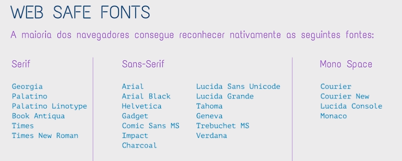

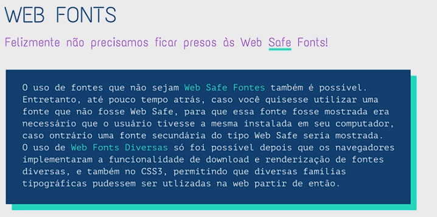

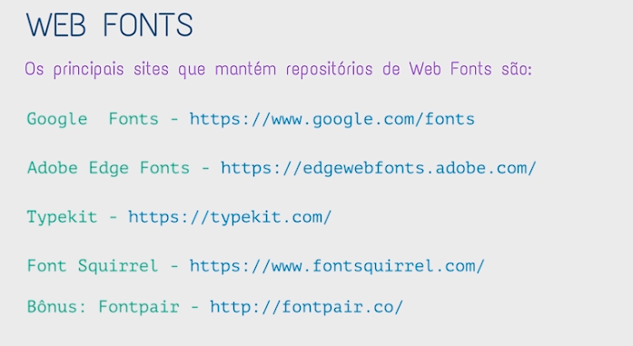


- 12 Cores na Web

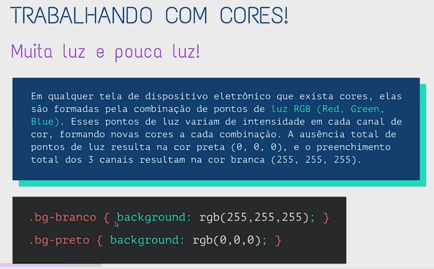

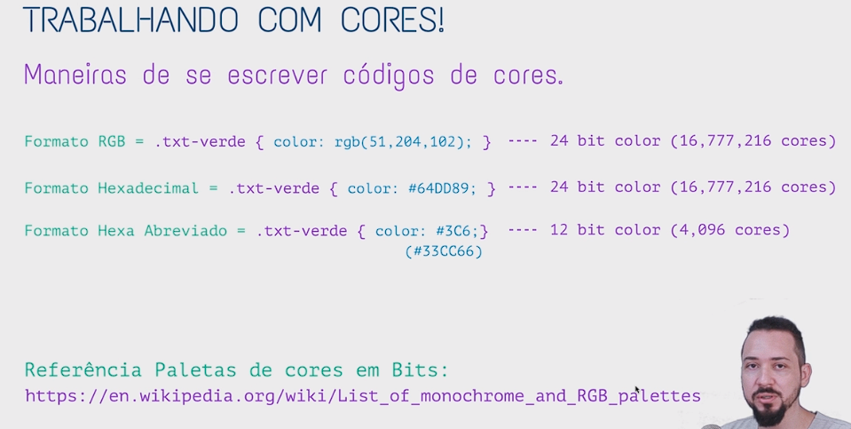

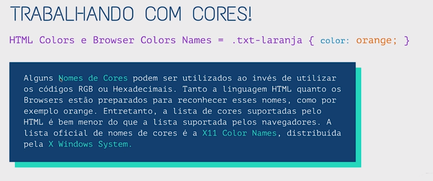

- 13 Exercício CSS 01 - Parte 1

[](Secao02-IntroducaoaoHTMLeCSS/13-Exercicio-CSS-01)

- 14 Exercício CSS 01 - Parte 2
- 15 Exercício CSS 01 - Parte 3
- 16 Exercício CSS 01 - Parte 4
- 17 Exercício CSS 01 - Parte 5
- 18 Design patterns e o Atomic Design
- 19 Exercício CSS 02 - Parte 1
- 20 Exercício CSS 02 - Parte 2
- 21 Exercício CSS 02 - Parte 3
- 22 Exercício CSS 02 - Parte 4
- 23 Exercício CSS 02 - Parte 5
- 24 Exercício CSS 02 - Parte 6
- 25 Exercício CSS 02 - Parte 7
- 26 Exercício CSS 02 - Parte 8

[Voltar ao Índice](#indice)

---

## <a name="parte3">3 - Seção 3: Layouts, Grids e Flexbox</a>

[Voltar ao Índice](#indice)

---

## <a name="parte4">4 - Seção 4: Animações com CSS e SVG</a>

[Voltar ao Índice](#indice)

---

## <a name="parte5">5 - Seção 5: Javascript</a>

[Voltar ao Índice](#indice)

---

## <a name="parte6">6 - Seção 6: JQuery (opcional)</a>

[Voltar ao Índice](#indice)

---

## <a name="parte7">7 - Seção 7: Projeto Final</a>

[Voltar ao Índice](#indice)

---

## <a name="parte8">8 - Seção 8: Publicando o Site</a>

[Voltar ao Índice](#indice)

---
